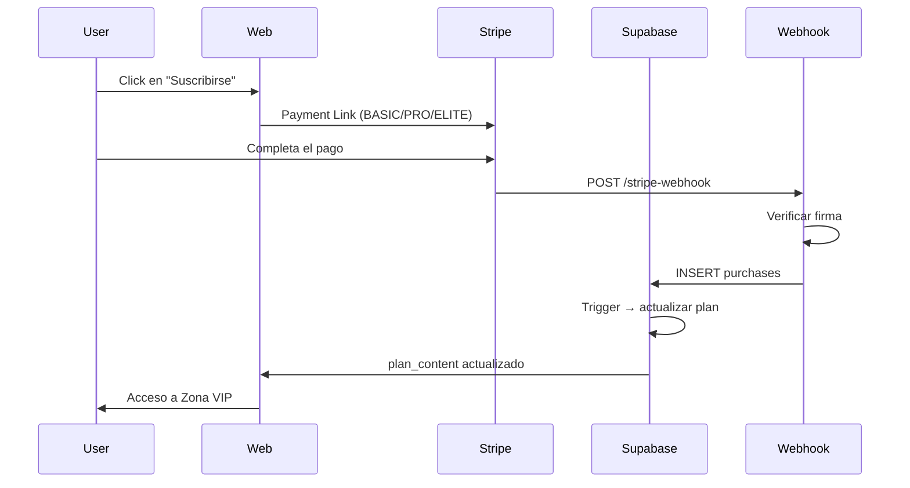

# VANTS - Plataforma de Esports Premium

[](#-licencia)
[](https://supabase.com)
[](https://discord.com)

Plataforma competitiva de esports con autenticación multi-proveedor, pagos con Stripe, integración con Steam/Valorant/Riot, torneos automatizados y bot de Discord.

**Demo:** [https://vantsbetaa.pplx.app/](https://vantsbetaa.pplx.app/)

---

## 🚀 Características

### Autenticación & Acceso
- ✅ **Supabase Auth** con correo + contraseña (verificación por email, recuperación)
- ✅ **OAuth:** Google, Discord (PKCE flow)
- ✅ **Steam:** OpenID 2.0 vía Edge Functions
- ✅ **Riot Games:** vinculación de cuentas para Valorant

### Pagos & Suscripciones
- 💳 **Stripe live** - Payment Links
  - BASIC: 9 € (IVA incluido)
  - PRO: 19 € (IVA incluido)
  - ELITE: 39 € (IVA incluido)
- 🔔 Webhook (desplegado aparte) → actualización de planes
- 🎯 Zona VIP con contenido exclusivo por plan

### Torneos & Competición
- 🏆 Creación y gestión de torneos multi-juego
- 📊 Tablas de clasificación (leaderboards)
- 🎮 12 juegos soportados: LoL, MLBB, FC26, Fortnite, Clash Royale, Rocket League, Valorant, CS2, COD Warzone, Apex Legends, Overwatch 2, Rainbow Six Siege
- 📝 Sistema de inscripción automática
- 🔔 Notificaciones en Discord

### Integraciones Externas
- 🎮 **Steam:** vinculación de cuentas (OpenID 2.0)
- 🔫 **Valorant:** stats ranked vía ValoTracker bot
- 💬 **Discord:** bot `vantcall` con comandos `/vincular riot` y `/perfil`
- 🌐 **Riot Games:** API para datos de jugadores

### Panel de Administración
- 👑 Dashboard exclusivo para admins (`public.web_admins`)
- 📈 Métricas: jugadores, torneos, eventos, ranked, soporte
- 🤖 Gestión del bot Discord (activar/desactivar comandos, sync, announce)
- 💎 Configuración de planes y contenido VIP

---

## 🏗️ Arquitectura

```
VantsportsOficial/
├── index.html, app.js, auth.js, admin.js, zona.js, data.js, db.js, ranks.js, premium.js
│                          # Frontend estático (HTML + JS vanilla + CSS), sin build
├── *.css                  # Estilos (base, style, premium, vip)
├── vendor/                # Librerías de terceros
├── bot/                   # Bot de Discord (Python, discord.py)
│   ├── main.py            # Cliente, comandos slash y arranque
│   ├── commands/          # perfil.py, vincular.py
│   ├── utils/             # health.py (healthcheck HTTP), supabase_client.py
│   └── requirements.txt
├── supabase/
│   ├── functions/         # Edge Functions
│   │   ├── steam-login/
│   │   ├── discord-commands/
│   │   ├── discord-admin/
│   │   └── discord-notify/
│   ├── schema.sql         # Estructura de BD
│   ├── seed.sql           # Datos iniciales
│   └── migrations/        # Migraciones
├── config.toml            # verify_jwt de las Edge Functions públicas
└── assets/
    ├── brand/             # Logo, favicon, iconos
    ├── ranks/             # 8 emblemas de rango premium
    └── BRAND.md           # Guía de marca
```

---

## 🗄️ Base de Datos (Supabase)

### Tablas Principales

| Tabla | Descripción |
|-------|-------------|
| `players` | Perfiles de jugadores (discord_user_id, auth_user_id, plan, verificación) |
| `user_game_accounts` | Cuentas externas vinculadas (Steam, Riot, etc.) con `verified = true` |
| `purchases` | Historial de compras Stripe (client_reference_id = user_id) |
| `tournament_participants` / `tournament_entries` | Inscripciones a torneos |
| `web_events` | Eventos de la web (publicados en Discord #web-eventos) |
| `web_admins` | Lista de administradores (RLS protegido) |
| `plan_content` | Contenido exclusivo por plan (BASIC/PRO/ELITE) |
| `bot_commands` | Catálogo de comandos del bot (activar/desactivar, plan mínimo) |
| `discord_channels` | Canales para notificaciones de torneos/eventos |

### Seguridad (RLS)

- 🔒 `web_admins`: solo lectura/escritura para admins
- 🔒 `purchases`: solo el usuario propietario
- 🔒 `user_game_accounts`: índice único `(user_id, game)`
- 🔒 Secretos en **Supabase Vault** (nunca en el repo)

---

## 🤖 Bot de Discord (`vantcall`)

### Comandos Disponibles

**Gateway (Python, `bot/main.py`)**

| Comando | Descripción |
|---------|-------------|
| `/vincular riot` | Vincula cuenta de Riot Games al perfil |
| `/perfil` | Muestra el perfil VANTS del jugador |
| `/valorant ranking` | Top 10 de Valorant |
| `/valorant perfil` | Stats de Valorant de un jugador |
| `/setup` | Configura los canales del servidor (solo administradores) |

**HTTP Interactions (Edge Function `discord-commands`)**: `/ayuda`, `/zona`, `/web`, `/vincular`, `/perfil`, `/ranking`, `/torneos`, `/torneo inscribir`, `/eventos`, `/calendario`, `/planes` y los comandos de staff `/vants ...`. El catálogo se gestiona en la tabla `bot_commands`.

**Panel admin web (Edge Function `discord-admin`)**: acciones `status`, `connect`, `sync` y `announce`, que requieren un usuario de `web_admins`. No son comandos slash.

### Implementación

- **Gateway (Python):** `bot/main.py` con `discord.py`; expone `GET /` en `$PORT` como healthcheck
- **HTTP Interactions (Edge Functions):** `discord-commands`, `discord-admin`, `discord-notify`
- **Despliegue:** Railway/Render con variables de entorno:
  ```bash
  DISCORD_TOKEN=<tu_token>
  DISCORD_GUILD_ID=<id_del_servidor>
  SUPABASE_URL=https://qtetsgwwsvqzquxssudj.supabase.co
  SUPABASE_SERVICE_ROLE_KEY=<service_role_key>
  ```

> ⚠️ **Nota:** Si usas el endpoint HTTP (Edge Functions), Discord solo envía interacciones al endpoint, no al gateway Python.

---

## 🔐 Seguridad & Secretos

### Variables de Entorno (Nunca en el repo)

| Variable | Ubicación | Uso |
|----------|-----------|-----|
| `STRIPE_WEBHOOK_SECRET` | Supabase Vault / .env | Verificar firma de webhooks |
| `STEAM_WEB_API_KEY` | Supabase Vault | API de Steam (OpenID) |
| `DISCORD_TOKEN` | Supabase Vault / .env | Bot de Discord |
| `SUPABASE_SERVICE_ROLE_KEY` | Supabase Vault / .env | Operaciones admin en BD |
| `STEAM_LOGIN_REDIRECTS` | Supabase Vault | Lista de destinos permitidos |

### OAuth Configuration

- **Site URL:** `https://vantsbetaa.pplx.app`
- **Redirect URLs:** `https://vantsbetaa.pplx.app/**`
- **Discord Client ID:** `1552959749891297320`
- **Discord Redirect:** `https://qtetsgwwsvqzquxssudj.supabase.co/auth/v1/callback`
- **Google Cloud Redirect:** `https://qtetsgwwsvqzquxssudj.supabase.co/auth/v1/callback`

---

## 🛠️ Instalación & Desarrollo

### Prerrequisitos

- Python 3.10+ (frontend y bot)
- Node.js 18+ (solo para la Supabase CLI)

### Frontend

Es un sitio estático: no hay `package.json` ni paso de build. Las claves de Supabase (URL y anon key) están en `db.js`.

```bash
# Servir en local
python3 -m http.server 8080
# Abrir http://localhost:8080
```

### Bot de Discord

```bash
cd bot

# Instalar dependencias
pip install -r requirements.txt

# Copiar y configurar .env
cp .env.example .env
# Editar: DISCORD_TOKEN, SUPABASE_SERVICE_ROLE_KEY

# Ejecutar
python main.py
# O desde la raíz: python bot/main.py
```

### Edge Functions

```bash
# Instalar Supabase CLI
npm install -g supabase

# Login
supabase login

# Link al proyecto
supabase link --project-ref qtetsgwwsvqzquxssudj

# Deploy de funciones (verify_jwt se toma de config.toml)
supabase functions deploy steam-login
supabase functions deploy discord-commands
supabase functions deploy discord-admin
supabase functions deploy discord-notify
```

> `stripe-webhook` no está en este repo. Los Payment Links de Stripe están en `auth.js`; la asignación automática de planes depende de un webhook que debe desplegarse aparte.

---

## 📊 Flujo de Pagos (Stripe)



---

## 🎨 Branding & Diseño

- **Logo:** `assets/brand/` (favicon, icono Discord, imagen social)
- **Rangos:** 8 emblemas premium en `assets/ranks/` (generados por `ranks.js`)
- **Guía completa:** [`assets/BRAND.md`](assets/BRAND.md)

---

## 📝 Scripts SQL

### Esquema Base

```bash
supabase/schema.sql                                   # Tablas principales
supabase/seed.sql                                     # Datos iniciales
supabase/migrations/20261001_admin_bot_premium.sql    # Admins, bot y premium
supabase/migrations/20261001_owner_identities.sql     # Propietario e identidades
```

### Ejecutar Migraciones

```bash
# Con la CLI (recomendado)
supabase db push

# O manualmente con psql
psql "postgresql://postgres:<password>@db.qtetsgwwsvqzquxssudj.supabase.co:5432/postgres" \
  -f supabase/schema.sql \
  -f supabase/seed.sql \
  -f supabase/migrations/20261001_admin_bot_premium.sql \
  -f supabase/migrations/20261001_owner_identities.sql
```

---

## 🔧 Troubleshooting

### Error `invalid_client` en Discord OAuth

1. Ve a [Discord Developer Portal](https://discord.com/developers/applications)
2. OAuth2 → **Reset Secret**
3. Copia el nuevo Client Secret
4. Supabase → Authentication → Providers → Discord → pega el nuevo secret
5. Redirect obligatoria: `https://qtetsgwwsvqzquxssudj.supabase.co/auth/v1/callback`

### Bot no responde a comandos

- Verifica que `DISCORD_TOKEN` esté correcto en .env
- Revisa que el bot tenga permisos en el servidor
- Si usas Edge Functions, asegúrate de que el endpoint esté activo

### Webhook de Stripe no funciona

- Verifica `STRIPE_WEBHOOK_SECRET` en Supabase Vault
- Prueba el endpoint (desplegado aparte, ver sección Edge Functions) con [Stripe CLI](https://stripe.com/docs/stripe-cli):
  ```bash
  stripe listen --forward-to https://qtetsgwwsvqzquxssudj.supabase.co/functions/v1/stripe-webhook
  ```

---

## 📄 Licencia

MIT License.

---

## 🤝 Contribuir

1. Fork el repo
2. Crea una rama (`git checkout -b feature/nueva-funcionalidad`)
3. Commit (`git commit -m 'Añade nueva funcionalidad'`)
4. Push (`git push origin feature/nueva-funcionalidad`)
5. Pull Request

---

## 📞 Contacto

- **Web:** [https://vantsbetaa.pplx.app/](https://vantsbetaa.pplx.app/)
- **Discord:** Únete al servidor oficial
- **Email:** feisplaa@gmail.com

---

<div align="center">

**Hecho con ❤️ por VANTS Team**

[](https://supabase.com)
[](https://discord.com)
[](https://stripe.com)

</div>
